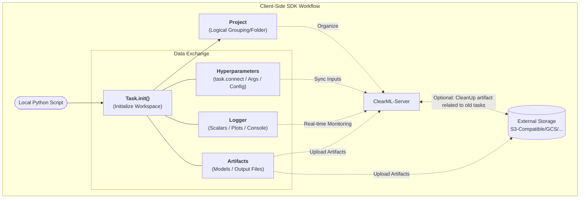

# ClearML Client

## Setup

1. In `./clearml-client`, run:

```bash
uv sync --group client
```

2. Run the ClearML setup script (if you already have `~/.clearml.conf` file, you might need to remove it first):

```bash
clearml-init
```

3. Go to `{YOUR_CLEARML_SERVER_DOMAIN}/login` and sign in/up
  - ClearML Server OSS might need pre-created users by admin (Refer to [../clearml-server/config/apiserver.conf.default](../clearml-server/config/apiserver.conf.default))

4. Go to `Settings` -> `Workspace` and create new API credentials

5. Copy clearml.conf that clearml-server provides and paste it in stdin of `clearml-init` command (or save it as `~/.clearml.conf`)

```conf
# Example of clearml.conf
api {
  web_server: http://{YOUR_CLEARML_SERVER_DOMAIN}:8080
  api_server: http://{YOUR_CLEARML_SERVER_DOMAIN}:8008
  files_server: http://{YOUR_CLEARML_SERVER_DOMAIN}:8081
  credentials {
    "access_key" = "{ISSUED_ACCESS_KEY}"
    "secret_key" = "{ISSUED_SECRET_KEY}"
  }
}
```

6. (Optional) If you want to use external storage for artifact management, add additional configuration in `~/.clearml.conf` by following https://clear.ml/docs/latest/docs/configs/clearml_conf/
   - For example, below config will automatically use aws s3 credentials in `~/.aws/credentials` without specifying `key` and `secret`,... in `~/.clearml.conf`
   ```conf
    aws{
        s3 {
            credentials: [
                {
                    host: "{YOUR_S3_COMPATIBLE_ENDPOINT}"
                    use_credentials_chain: true
                    verify: false # for s3-compatible storage without SSL
                    secure: false # for s3-compatible storage without SSL
                }
            ]
        }
    }
   ```

## ClearML Client-Side SDK Workflow

With Web UI on ClearML Server, It will be easier to understand how the client-side SDK works. 

The following diagram illustrates the typical workflow of using ClearML Client-Side SDK in a local Python script, and how it interacts with ClearML Server and external storage for data exchange and artifact management.



## Getting Started with examples

The examples are based on https://github.com/clearml/clearml/v2.1.3/examples.

1. Copy `.env.default` to `.env`. And configure `CLEARML_OUTPUT_URI` if you want to save artifacts to external storage
   - ***e.g.*** `CLEARML_OUTPUT_URI=s3://{YOUR_BUCKET_NAME}/{path}` (Make sure you have the right credentials configured in `~/.clearml.conf` for the storage you want to use) 
   - s3-compatible storage, it might need endpoint(also port if not default 443). For example, `CLEARML_OUTPUT_URI=s3://{YOUR_S3_COMPATIBLE_ENDPOINT}:{port}/{bucket_name}/{path}`
2. Run `python pytorch_mnist.py` with flag specified in argument parser
   - ***e.g.*** `python pytorch_mnist.py --project-name "mnist-training-poc" --task-name "pytorch_mnist"` 
3. Access ClearML Server Web UI, and find the created project and task. Also verify the artifacts are uploaded to storage you want successfully.
